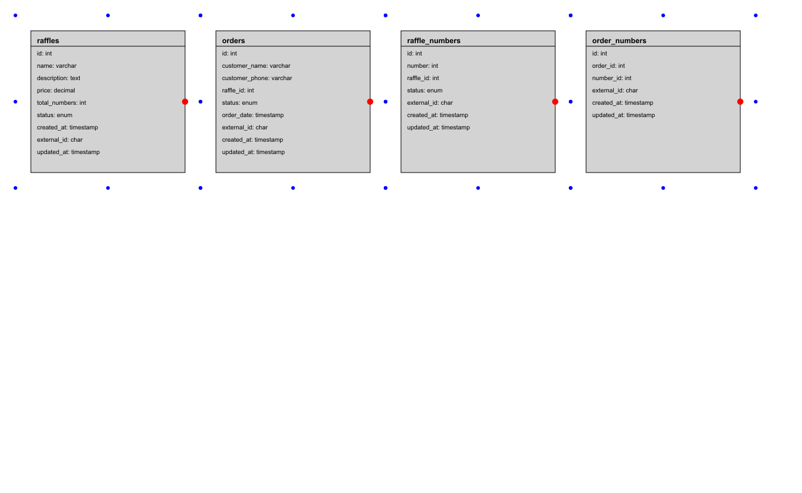

# Repositório do micro-serviço Rifa

## Rifa Database

Este documento descreve a estrutura do banco de dados e os passos para sua criação, incluindo a definição das tabelas, colunas, comentários, funções e triggers. A motivação para a criação deste documento é fornecer um guia detalhado para a configuração do banco de dados, garantindo que todas as etapas sejam seguidas corretamente para uma implementação consistente. Este documento também explica as vantagens de utilizar colunas como `external_id`, funções e triggers diretamente no banco de dados, comparado com a implementação no backend.

### Vantagens das Abordagens

**external_id**:
- Garantia de unicidade: Utilizar `external_id` como identificador único externo garante que cada registro possa ser identificado de forma única, mesmo em sistemas distribuídos.
- Facilidade de integração: `external_id` facilita a integração com outros sistemas e serviços que exigem identificadores únicos que não mudam.

**Funções e Triggers**:
- Consistência dos dados: Triggers garantem que certas regras de negócios sejam aplicadas consistentemente em todo o banco de dados.
- Redução de lógica no backend: Ao mover a lógica de verificação e restrições para o banco de dados, reduz-se a complexidade do código no backend.
- Melhoria da performance: Operações críticas podem ser otimizadas diretamente no banco de dados, evitando a necessidade de múltiplas consultas e verificações no backend.

### Dicionário de Dados

### Diagrama

## Tabela `public.raffles`

Tabela que armazena informações sobre raffles.

### Estrutura da Tabela

| Coluna | Tipo | Nulo | Comentário |
|---|---|---|---|
| id | int | NÃO | - |
| name | varchar | NÃO | - |
| description | text | SIM | - |
| price | decimal | NÃO | - |
| total_numbers | int | NÃO | - |
| status | enum | SIM | - |
| created_at | timestamp | SIM | - |
| external_id | char | SIM | - |
| updated_at | timestamp | SIM | - |

### Comentários das Colunas

- **id**: Sem comentário.
- **name**: Sem comentário.
- **description**: Sem comentário.
- **price**: Sem comentário.
- **total_numbers**: Sem comentário.
- **status**: Sem comentário.
- **created_at**: Sem comentário.
- **external_id**: Sem comentário.
- **updated_at**: Sem comentário.

---

## Tabela `public.orders`

Tabela que armazena informações sobre orders.

### Estrutura da Tabela

| Coluna | Tipo | Nulo | Comentário |
|---|---|---|---|
| id | int | NÃO | - |
| customer_name | varchar | NÃO | - |
| customer_phone | varchar | SIM | - |
| raffle_id | int | SIM | - |
| status | enum | SIM | - |
| order_date | timestamp | SIM | - |
| external_id | char | SIM | - |
| created_at | timestamp | SIM | - |
| updated_at | timestamp | SIM | - |

### Comentários das Colunas

- **id**: Sem comentário.
- **customer_name**: Sem comentário.
- **customer_phone**: Sem comentário.
- **raffle_id**: Sem comentário.
- **status**: Sem comentário.
- **order_date**: Sem comentário.
- **external_id**: Sem comentário.
- **created_at**: Sem comentário.
- **updated_at**: Sem comentário.

---

## Tabela `public.raffle_numbers`

Tabela que armazena informações sobre raffle numbers.

### Estrutura da Tabela

| Coluna | Tipo | Nulo | Comentário |
|---|---|---|---|
| id | int | NÃO | - |
| number | int | NÃO | - |
| raffle_id | int | SIM | - |
| status | enum | SIM | - |
| external_id | char | SIM | - |
| created_at | timestamp | SIM | - |
| updated_at | timestamp | SIM | - |

### Comentários das Colunas

- **id**: Sem comentário.
- **number**: Sem comentário.
- **raffle_id**: Sem comentário.
- **status**: Sem comentário.
- **external_id**: Sem comentário.
- **created_at**: Sem comentário.
- **updated_at**: Sem comentário.

---

## Tabela `public.order_numbers`

Tabela que armazena informações sobre order numbers.

### Estrutura da Tabela

| Coluna | Tipo | Nulo | Comentário |
|---|---|---|---|
| id | int | NÃO | - |
| order_id | int | SIM | - |
| number_id | int | SIM | - |
| external_id | char | SIM | - |
| created_at | timestamp | SIM | - |
| updated_at | timestamp | SIM | - |

### Comentários das Colunas

- **id**: Sem comentário.
- **order_id**: Sem comentário.
- **number_id**: Sem comentário.
- **external_id**: Sem comentário.
- **created_at**: Sem comentário.
- **updated_at**: Sem comentário.